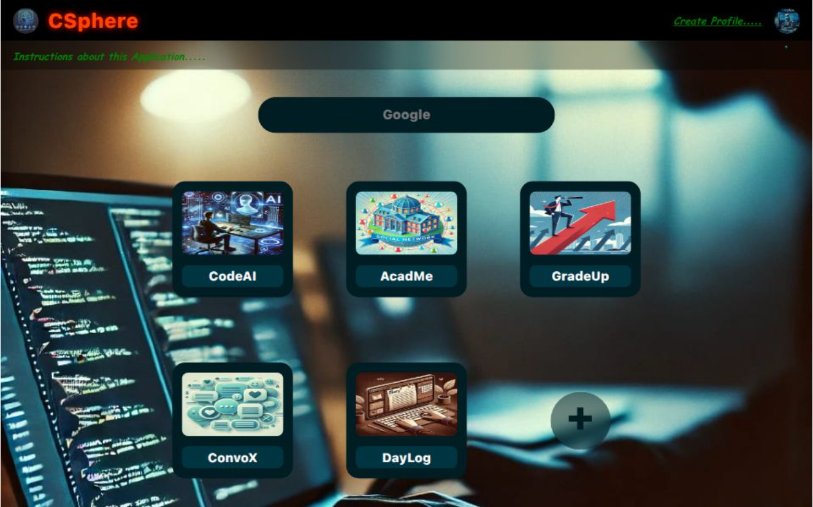

<h1 align="center" style="color:#2c3e50;">🧠 CSphere</h1>

<p align="center">
  
</p>

<p align="center">
  <b>An AI-driven coding assistant to enhance productivity and code quality in real-time.</b><br>
  Offers smart suggestions, debugging support, and intelligent auto-completion as you code.
</p>

---

## 📄 About the Project

## 📄 About the Project

**CodeAI** is a smart code assistant designed to help developers write cleaner, faster, and bug-free code.  
It delivers real-time AI-powered suggestions, highlights syntax issues, and supports intelligent error correction — all within your development flow.

---

## 🌟 Features

- ⚡ **Real-time AI Suggestions**  
  Get instant code recommendations based on what you’re typing.

- 🧠 **Error Detection & Debugging**  
  Automatically detect bugs and get guided fixes before compilation.

- 📚 **Multi-language Support** *(Planned)*  
  Initially supports JavaScript, with plans to add Java, Python, and more.

- 🔍 **Code Optimization Tips**  
  Receive suggestions for improving performance, structure, and readability.

- 💬 **Interactive Assistant**  
  Chat with an AI bot about logic, syntax, or alternative approaches.

- 💻 **Developer-Centric UI**  
  Clean and intuitive interface focused on coding efficiency.

---

## 🛠️ Tech Stack

> This is a full-stack application powered by AI models (under development).

- ⚛️ **Frontend:** React.js  
- 🧠 **AI Engine:** Custom Node.js APIs integrated with code analysis models  
- 🌐 **Backend:** Node.js + Express.js  
- 🗃️ **Database:** MongoDB  
- ✨ **Future:** Integration with LLMs & language servers

---

## 🚀 Live Demo

🌐 **App Link (Coming Soon):**  
[🔗 codeai.dev] https://code-ai-mocha.vercel.app/

---

## 📁 Project Structure
```bash
codeai/
├── client/                  # React Frontend
│ ├── src/
│ │ ├── components/
│ │ ├── services/
│ │ ├── assets/
│ └── index.html
```
⚙️ Getting Started
1️⃣ Clone the Repository
bash
Copy
Edit
git clone https://github.com/rockyhans/CodeAI
bash
Copy
Edit
cd csphere

2️⃣ Install Dependencies
# For frontend
```
cd app
npm install
```
App will be running at:
<br>
Frontend → http://localhost:3000 

Stay tuned for updates!

👤 Contributors
<table> <tr> <td align="center">  <br /><sub><b>Danish Rizwan</b></sub><br /> <sub>Full-Stack Developer</sub> </td> </tr> </table>
📬 Contact
<br>
📧 Email: rdanishrizwan@example.com
<br>
💼 Team: CodeAI Dev Core

